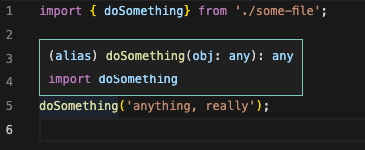

# skipLibCheck Example 1 - Ignoring Errors

In this example, you can see that `tsc` treats invalid types as `any` when `skipLibCheck` is enabled.

Without `skipLibCheck`, `tsc` will throw an error when defining an invalid type.  
Please note that the usage of the invalid type does not throw an error, and even the IDE treats it as any:  


When compiling without `skipLibCheck`:

```bash
> npx tsc --project . && echo 'success!'

some-file.d.ts:1:21 - error TS2304: Cannot find name 'NON_EXISTING_TYPE'.

1 type INVALID_TYPE = NON_EXISTING_TYPE;
                      ~~~~~~~~~~~~~~~~~


Found 1 error.
```

When compiling with `skipLibCheck`, the invalid type will simple be treated as `any`, and the compilation will be successful:

```bash
> npx tsc  --project . --skipLibCheck && echo 'success!'

success!
```
