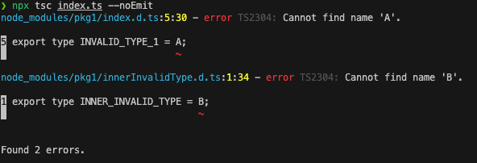

# TypeScript's `--skipLibCheck` Examples

This is a demo project, simulates a TS project. The goal is to simulate a project with different scenarios, regarding to dependencies validity and the TS compilation configurations.  
We simulate the dependencies by managing the content of `node_modules`. For this reason, there's no `package.json`.  
All of the "libraries" (dependencies) in this repository are not actual npm packages. They are part of the repository, and placed under `node_modules` so that TypeScript's compiler will treat them as libraries.

## Project Structure

`pkg1` exports in its [`d.ts` file](./node_modules/pkg1/index.d.ts):

1. A function called `log`.

2. An invalid type called `INVALID_TYPE_1`. It is invalid since it refers a non-existing type.

3. An additional invalid type, `INNER_INVALID_TYPE`, which is imported from an internal module of `pkg1`.

`unused-pkg` exports in its [`d.ts` file](./node_modules/unused-pkg/index.d.ts) a single type called `UNUSED_INVALID_TYPE`.  This package represents packages that were added in `package.json`, but were not required.

In our [`index.ts` file](./index.ts) we import `pkg1`'s `log` function. This means our code defer `INVALID_TYPE_1`, but not importing it directly. The rest is left unused.

## Compiling

When running `npx tsc index.ts --skipLibCheck --noEmit`  the compilation will be successful, we'll have no errors.

When running `npx tsc index.ts --noEmit` (without `--skipLibCheck`) we'll see the following errors:  

